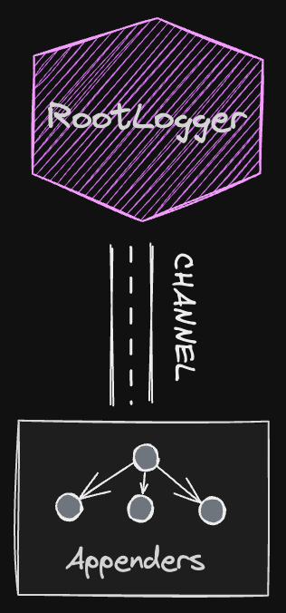

# log4k


[](http://kotlinlang.org)

A Comprehensive Logging and Tracing Solution for Kotlin Multiplatform.

This project provides a robust, event-driven logging and tracing platform specifically designed for Kotlin
Multiplatform (also compatible with the Java ecosystem). Built with coroutines and channels at its core, it offers
asynchronous, scalable logging across multiple platforms.

> [!IMPORTANT]  
> The project is in a very early stage; thus, breaking changes should be expected.

📖 [Documentation](https://smyrgeorge.github.io/log4k/)

🏠 [Homepage](https://smyrgeorge.github.io/) (under construction)

## TODO

- [ ] `CoroutineContexAwareLogger`: `Logger` that will collect more info from the coroutine context.
- [ ] Ability to chain appenders
- [ ] Json console logger
- [ ] `LogbackAppender`: `Appender` that will publish the logging events to the logback.

## Architecture

<!--suppress HtmlDeprecatedAttribute -->
<p align="center">
  <!--suppress CheckImageSize -->

</p>

At the core of the logging system is the `RootLogger`, which manages a `Channel<LoggingEvent>`. All logging events are
enqueued in this channel, and the `RootLogger` is responsible for distributing them to the registered appenders (refer
to `RootLogger` for more details).

Each `Appender` may also maintain its own `Channel`, which is particularly beneficial in scenarios that require
batching—such as sending batched log or trace events over the network or appending them to a file. For instance, the
`FlowAppender` leverages `kotlinx.coroutines.flow.Flow` to process incoming events efficiently.

On the other hand, some appenders can be simpler and do not require a `Channel` for event processing. For example, the
`ConsoleAppender` directly prints each incoming event to the console without queuing, offering a straightforward logging
solution.

The tracing module, works with exactly the same architecture.

## Logging API

```kotlin
// Create a Logger.
private val log: Logger = Logger.of(this::class)

log.info("this is test log")
log.info("this is test with 1 arg: {}", "hello")
log.error(e.message, e)
```

We also support a more kotlin style API:

```kotlin
log.debug { "ignore" }
log.debug { "ignore + ${5}" } // Will be evaluated only if DEBUG logs are enabled.
log.error { e.message }
log.error(e) { e.message } // e: Throwable
```

## Tracing API

```kotlin
private val trace: Tracer = Tracer.of(this::class)
// We need to manually register an appender.
// The [SimpleConsoleTracingAppender] will print the traces in the console
// (is just an example, should not be used as a real example).
RootLogger.Tracing.register(SimpleConsoleTracingAppender())

// Create the span and then start it.
val span: TracingEvent.Span = trace.span("test").start()
span.event("this is a test event")
span.tracer
// Close the span manually.
span.end()

// Will produce the following tracing events:
// Start(id=span-1729420618-1, name=test, level=INFO, tracer=io.github.smyrgeorge.log4k.MainTests, parent=null, timestamp=2024-10-20T10:36:58.214095Z, thread=null)
// Event(id=span-1729420618-1-1, spanId=span-1729420618-1, level=INFO, tracer=io.github.smyrgeorge.log4k.MainTests, message=this is a test event, arguments=[], timestamp=2024-10-20T10:36:58.214126Z, thread=null)
// End(id=span-1729420618-1, level=INFO, tracer=io.github.smyrgeorge.log4k.MainTests, timestamp=2024-10-20T10:36:58.214139Z, thread=null)
```

Similarly to the logging API, we also support a more kotlin style API:

```kotlin
// Starts immediately the span.
trace.span("test") {
    // Send events that are related to the current span.
    it.event("this is a test event")
    // Automatically closes at the end of te scope.
}
```

## Examples

```kotlin
// Create a Logger.
private val log: Logger = Logger.of(this::class)
private val trace: Tracer = Tracer.of(this::class)
RootLogger.Tracing.register(SimpleConsoleTracingAppender())

log.debug("ignore")
log.debug { "ignore + ${5}" } // Will be evaluated only if DEBUG logs are enabled.
log.info("this is a test")

// Support for mute/unmute each logger programmatically.
// The [RootLogger] maintains a list with all registered loggers.
RootLogger.Logging.logges.mute("io.github.smyrgeorge.log4k.MainTests")
log.info("this is a test with 1 arg: {}", "hello")
log.unmute() // Will set the logging level that had before was muted.
log.info("this is a test with 1 arg: {}", "hello")

try {
    error("An error occurred!")
} catch (e: Exception) {
    log.error(e.message)
    log.error(e) { e.message }
}

// Create custom appenders.
// See [BatchAppender] for more information.
class MyBatchAppender(size: Int) : BatchAppender<LoggingEvent>(size) {
    override suspend fun append(event: List<LoggingEvent>) {
        // E.g. send batch over http.
        // In this case every [append] method will be called every 5 elements.
        println(event.joinToString { it.message })
    }
}

val appender = MyBatchAppender(5)
// Register the appender.
RootLogger.Logging.appenders.register(appender)

// Will print:
// 0, 1, 2, 3, 4
// 5, 6, 7, 8, 9
repeat(10) {
    log.info("$it")
    delay(500)
}

// Starts immediately the span.
trace.span("test") {
    // Send events that are related to the current span.
    it.event("this is a test event")
    // Automatically closes at the end of te scope.
}

// Create the span and then start it.
val span: TracingEvent.Span = trace.span("test").start()
span.event("this is a test event")
span.tracer
// Close the span manually.
span.end()
```