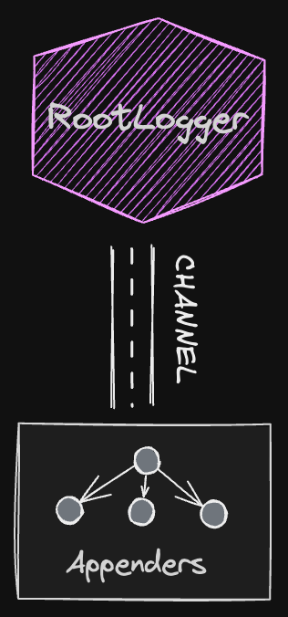

# log4k


[](http://kotlinlang.org)


A Comprehensive Logging and Tracing Solution for Kotlin Multiplatform.

This project provides a robust, event-driven logging and tracing platform specifically designed for Kotlin
Multiplatform (also compatible with the Java ecosystem). Built with coroutines and channels at its core, it offers
asynchronous, scalable logging across multiple platforms.

This project also tries to be fully compatible with `OpenTelemetry` standard.

📖 [Documentation](https://smyrgeorge.github.io/log4k/)

🏠 [Homepage](https://smyrgeorge.github.io/) (under construction)

## Table of Contents

- [Usage](#usage)
    - [Extension Modules](#extension-modules)
- [Architecture](#architecture)
- [Logging API](#logging-api)
    - [Context Parameters Support](#context-parameters-support)
    - [Full SLF4J Integration Supported](#full-slf4j-integration-supported)
    - [Json Appender](#json-appender)
- [Tracing API](#tracing-api)
- [Metering API](#metering-api)
    - [Counter](#counter)
    - [UpDownCounter](#updowncounter)
    - [Gauge](#gauge)
    - [Histogram](#histogram)
- [Compiler Plugin](#compiler-plugin)
    - [Setup](#setup)
    - [Logging (`@Logged`)](#logging-logged)
    - [Metering (`@Timed`)](#metering-timed)
    - [Tracing (`@Traced`)](#tracing-traced)
- [Appenders](#appenders)
    - [Logging](#logging)
    - [Tracing](#tracing)
    - [Metering](#metering)
    - [Flow-based base appenders](#flow-based-base-appenders)
    - [Prevent log/trace flooding](#prevent-logtrace-flooding)
- [Examples](#examples)

## Usage

```kotlin
// https://central.sonatype.com/artifact/io.github.smyrgeorge/log4k
implementation("io.github.smyrgeorge:log4k:x.y.z")
```

### Extension Modules

Starting with Kotlin 2.3.20, what was previously a call-ambiguity warning between context-aware and non-context
extension functions became a compilation error. To resolve this, the lambda-based extension functions have been
split into two separate modules:

**`log4k-classic`** — Lambda extensions **without** context receivers (standard usage):

```kotlin
// https://central.sonatype.com/artifact/io.github.smyrgeorge/log4k-classic
implementation("io.github.smyrgeorge:log4k-classic:x.y.z")
```

```kotlin
log.debug { "ignore" }
log.debug { "ignore + ${5}" } // Will be evaluated only if DEBUG logs are enabled.
log.error(e) { e.message }
```

**`log4k-context`** — Lambda extensions **with** context receivers (`TracingContext`) for automatic span propagation:

```kotlin
// https://central.sonatype.com/artifact/io.github.smyrgeorge/log4k-context
implementation("io.github.smyrgeorge:log4k-context:x.y.z")
```

```kotlin
trace.span("my-operation") {
    // TracingContext is in scope — span is automatically attached to log events.
    log.info { "Processing started" }
    log.error(exception) { "Operation failed" }
}
```

You can depend on both modules simultaneously if you need both styles in the same source set.

## Architecture

<!--suppress HtmlDeprecatedAttribute -->
<p align="center">
  <!--suppress CheckImageSize -->

</p>

At the core of the logging system is the `RootLogger`, which manages a `Channel<LoggingEvent>`. All logging events are
enqueued in this channel, and the `RootLogger` is responsible for distributing them to the registered appenders (refer
to `RootLogger` for more details).

Each `Appender` may also maintain its own `Channel`, which is particularly beneficial in scenarios that require
batching—such as sending batched log or trace events over the network or appending them to a file. For instance, the
`FlowAppender` leverages `kotlinx.coroutines.flow.Flow` to process incoming events efficiently.

On the other hand, some appenders can be simpler and do not require a `Channel` for event processing. For example, the
`SimpleConsoleLoggingAppender` directly prints each incoming event to the console without queuing, offering a
straightforward logging
solution.

The tracing module shares exactly the same principals.

## Logging API

By default, a platform-specific appender is automatically registered:

- **Android**: `AndroidLoggingAppender` (routes to Android Logcat)
- **iOS/macOS**: `AppleLoggingAppender` (routes to Apple's Unified Logging)
- **All other platforms**: `SimpleConsoleLoggingAppender` (color-coded console output)

You can change the default behavior by unregistering all appenders early in your program:

```kotlin
RootLogger.Logging.appenders.unregisterAll()
```

After unregistering, you can register any appender you want like this:

```kotlin
RootLogger.Logging.appenders.register(SimpleJsonConsoleLoggingAppender())
```

```kotlin
// Create a Logger.
private val log: Logger = Logger.of(this::class)

log.info("this is test log")
log.info("this is test with 1 arg: {}", "hello")
log.error(e.message, e)
```

We also support a more kotlin style API:

```kotlin
log.debug { "ignore" }
log.debug { "ignore + ${5}" } // Will be evaluated only if DEBUG logs are enabled.
log.error { e.message }
log.error(e) { e.message } // e: Throwable
```

### Context Parameters Support

The logging API supports Kotlin's context receivers for automatic span propagation. When logging within a
`TracingContext`,
the current span is automatically attached to log events without explicitly passing it:

```kotlin
trace.span("my-operation") {
    // Inside this block, TracingContext is available as a context receiver.
    // Log statements automatically include the current span information.
    log.info { "Processing started" }  // Span context automatically attached
    log.debug { "Details: $data" }
    log.error(exception) { "Operation failed" }
}
```

This eliminates the need to manually pass the span to each log call:

```kotlin
// Without context receivers (explicit span passing):
trace.span("my-operation") {
    log.info(this, "Processing started")
}

// With context receivers (automatic span propagation):
trace.span("my-operation") {
    log.info { "Processing started" }  // Span is automatically included
}
```

All log levels (`trace`, `debug`, `info`, `warn`, `error`) support context receivers, both with message strings
and with lambdas for lazy evaluation.

See the [Logger](./log4k/src/commonMain/kotlin/io/github/smyrgeorge/log4k/Logger.kt)
and [TracingContext](./log4k/src/commonMain/kotlin/io/github/smyrgeorge/log4k/TracingContext.kt) classes for more
details.

### Full SLF4J Integration Supported

We’ve ensured complete compatibility with SLF4J, allowing seamless integration into projects that already use SLF4J as a
logging abstraction layer. By providing SLF4J support, `log4k` can be easily adopted in both new and existing
applications
without requiring significant changes to your current logging setup. This means you can leverage log4k’s powerful,
multiplatform capabilities while maintaining compatibility with other SLF4J-compatible libraries and frameworks.

To enable SLF4J integration, simply add the following dependency to your project:

```kotlin
// https://central.sonatype.com/artifact/io.github.smyrgeorge/log4k-slf4j
implementation("io.github.smyrgeorge:log4k-slf4j:x.y.z")
```

For detailed setup instructions and usage, see the project’s [README.md](./log4k-slf4j/README.md)

### Json Appender

```kotlin
// You can register the `SimpleJsonConsoleLoggingAppender` for json logs in the console.
RootLogger.Logging.appenders.register(SimpleJsonConsoleLoggingAppender())
```

## Tracing API

The tracing API is fully compatible with the `OpenTelemetry` standard, enabling seamless distributed tracing, metric
collection, and context propagation across services.

```kotlin
private val trace: Tracer = Tracer.of(this::class)
// We need to manually register an appender.
// The [SimpleConsoleTracingAppender] will print the traces in the console
// (is just an example, should not be used as a real example).
RootLogger.Tracing.appenders.register(SimpleConsoleTracingAppender())

// Create the span and then start it.
val span: TracingEvent.Span.Local = trace.span("test").start()
span.event(name = "test-event")
// Close the span manually.
span.end()
```

Similarly to the logging API, we also support a more kotlin style API:

```kotlin
trace.span("test", parent) {
    log.info(this, "this is a test with span") // The log will contain the span id.
    // Set span tags.
    tags["key"] = "value"
    // Send events that are related to the current span.
    event(name = "event-1", level = Level.DEBUG)
    debug(name = "event-1") // Same as event(name = "event-1", level = Level.DEBUG)
    // Include tags in the event.
    event(name = "event-2", tags = mapOf("key" to "value"))
    event(name = "event-2") { tags ->
        tags["key"] = "value"
    }
    // Nested Span.
    span("test-2") {
        event(name = "event-3", tags = mapOf("key" to "value"))
        log.info(this, "this is a test with span") // The log will contain the span id.
    }
    // Automatically closes at the end of the scope.
}
```

Additionally, you can instantiate a span that represents the parent span.
This is useful in cases that the parent span is created outside our application (e.g. received from an HTTP call).

```kotlin
// Create the parent span.
// NOTICE: we do not start it, since it's already started.
val parent: TracingEvent.Span.Remote = trace.span(id = "ID_EXAMPLE", traceId = "TRACE_ID_EXAMPLE")
trace.span("test", parent) {
    // Your logic here
}
```

In the examples above, we see two variations of the `Span` class:

- **Span.Local**: Represents a span created locally within our application, exposing all methods such as `start`, `end`,
  `event`, `debug`, `info`, and more.
- **Span.Remote**: Represents a span created outside our application and propagated to us (e.g., from an HTTP call). It
  does not expose any methods and serves only as a reference to the parent remote span.

## Metering API

A measurement captured at runtime.

A metric is a measurement of a service captured at runtime. The moment of capturing a measurements is known as a metric
event, which consists not only of the measurement itself, but also the time at which it was captured and associated
metadata.

Several types of metrics are supported:

- **Counter**: A value that accumulates over time – you can think of this like an odometer on a car; it only ever goes
  up.
- **UpDownCounter**: A value that accumulates over time, but can also go down again. An example could be a queue length,
  it will increase and decrease with the number of work items in the queue.
- **Gauge**: Measures a current value at the time it is read. An example would be the fuel gauge in a vehicle. Gauges
  are asynchronous.
- **Histogram**: A client-side aggregation of values, such as request latencies. A histogram is a good
  choice if you are interested in value statistics. For example: How many requests take fewer than 1s?

```kotlin
// Create a Counter that holds Int values.
val c1 = meter.counter<Int>("event-a")
delay(1000)
c1.increment(1, "label" to "pool-a")
c1.increment(1, "label" to "pool-a")

// Create a UpDownCounter that holds Double values.
val c2 = meter.upDownCounter<Double>("event-b")
delay(1000)
c2.increment(2.0, "label" to "pool-b")
c2.increment(2.0, "label" to "pool-b")
c2.decrement(2.0, "label" to "pool-b")

// Create a Gauge
val g1 = meter.gauge<Int>("thread-pool-size")
delay(1000)
g1.record(3, "pool" to "pool-a")
g1.record(6, "pool" to "pool-b")

// Create a Histogram that holds Double values.
val h1 = meter.histogram<Double>("request-duration")
delay(1000)
h1.record(0.3, "path" to "/a")
h1.record(0.5, "path" to "/a")
```

Each time an operation is performed (i.e., a measurement is taken with a meter), an event is triggered and propagated to
all registered appenders. For quick debugging you can register the `SimpleConsoleMeteringAppender`, which prints each
metric event directly to stdout. For aggregation and export, use the `SimpleMeteringCollectorAppender`:

```kotlin
val collector = SimpleMeteringCollectorAppender()
RootLogger.Metering.appenders.register(collector)
```

The `SimpleMeteringCollectorAppender` processes all events, updating the value for each registered instrument. It also
provides a method that returns a string with the collected data in the `OpenMetrics` line format.

```kotlin
val metrics = collector.toOpenMetricsLineFormatString()
println(metrics)

// The above example will print:
//
// # HELP event-a
// # TYPE event-a counter
// event-a {label="pool-a"} 2 1730360802506
//
// # HELP thread-pool-size
// # TYPE thread-pool-size gauge
// thread-pool-size {pool="pool-a"} 3 1730360802506
// thread-pool-size {pool="pool-b"} 6 1730360802506
//
// # HELP event-b
// # TYPE event-b updowncounter
// event-b {label="pool-b"} 4.0 1730360802506
//
// # TYPE request-duration histogram
// request-duration_bucket {path="/a", le="+Inf"} 2 1730360802506
// request-duration_sum {path="/a"} 0.8 1730360802506
// request-duration_count {path="/a"} 2 1730360802506
```

### Counter

A `Counter` accumulates a value that only ever goes up — for example the total number of processed requests. Use
`increment` to add to it, or `set` to assign an absolute value.

```kotlin
val requests = meter.counter<Int>("requests-total")
requests.increment(1, "path" to "/a")
requests.increment(1, "path" to "/a")
// You can also set an absolute value:
requests.set(10, "path" to "/a")
```

### UpDownCounter

An `UpDownCounter` behaves like a `Counter` but can also decrease — for example a queue length or the number of
in-flight
requests. In addition to `increment`/`set`, it supports `decrement`.

```kotlin
val queue = meter.upDownCounter<Int>("queue-size")
queue.increment(3, "queue" to "jobs")
queue.decrement(1, "queue" to "jobs")
```

### Gauge

A `Gauge` records the current value at the time it is read. We also provide a convenient way to periodically poll and
publish value changes, enabling automated and timely updates. This approach ensures that values are recorded
consistently, which is particularly useful for monitoring changes over time and minimizing manual intervention.

```kotlin
meter.gauge<Int>("thread-pool-size").poll(every = 10.seconds) {
    record(3, "pool" to "pool-a")
    record(6, "pool" to "pool-b")
}
```

Using this method, values are automatically recorded at regular intervals, making it ideal for tracking metrics in
dynamic environments.

### Histogram

A `Histogram` samples individual observations (such as request latencies or payload sizes) and lets appenders aggregate
their distribution. The `SimpleMeteringCollectorAppender` keeps a running `count` and `sum` per tag-set and exposes them
as the mandatory OpenMetrics `_count`, `_sum` and cumulative `+Inf` bucket series.

```kotlin
val durations = meter.histogram<Double>("request-duration", unit = "seconds")
durations.record(0.3, "path" to "/a")
durations.record(0.5, "path" to "/a")
```

Like a `Gauge`, a `Histogram` extends the recorder API, so it can also be polled at a fixed interval:

```kotlin
meter.histogram<Double>("request-duration").poll(every = 10.seconds) {
    record(measureLastRequestDuration(), "path" to "/a")
}
```

## Compiler Plugin

The [`log4k-compiler-plugin`](./log4k-compiler-plugin) is a Kotlin IR compiler plugin that automatically instruments
your code — wrapping functions in tracing spans (`@Traced`), entry/exit logging (`@Logged`) and call/duration metrics
(`@Timed`) — with no manual `trace.span("…") { }` blocks, `log.info("…")` calls or counters required. Because it
operates on common IR before backend lowering, it works across all Kotlin Multiplatform targets.

### Setup

Apply the Gradle plugin — it wires the compiler plugin onto every Kotlin compilation, so `@Traced`, `@Timed` and
`@Logged` are instrumented for all targets with nothing else to configure:

```kotlin
// https://central.sonatype.com/artifact/io.github.smyrgeorge/log4k-gradle-plugin
plugins {
    id("io.github.smyrgeorge.log4k") version "x.y.z"
}
```

The annotations and their runtime ship with the core `log4k` artifact, so make sure one of the runtime modules is also
on the classpath (`log4k`, `log4k-classic` or `log4k-context`):

```kotlin
dependencies {
    implementation("io.github.smyrgeorge:log4k-classic:x.y.z")
}
```

### Logging (`@Logged`)

Annotate a function with `@Logged` and its body is wrapped, at compile time, with entry/exit logging — no explicit
`log.info("…")` calls required:

```kotlin
class UserService {
    // Reused by the plugin; if omitted, `private val _log_ = Logger.of(this::class)` is synthesized.
    private val log = Logger.of(this::class)

    @Logged
    fun compute(x: Int): Int = x * x
}
```

Calling `compute(5)` emits (at `INFO` by default):

```
→ UserService.compute(x=5)
← UserService.compute = 25 (12.5us)
```

If the body throws, a `✗ UserService.compute failed (…)` line is logged at `ERROR` (with the throwable attached) and the
exception is rethrown. Both `suspend` and regular functions are supported (the wrapper reuses the `inline`
`Logger.logged` helper, which calls `Logger.log` directly).

- **Level** — `@Logged(level = Level.DEBUG)`; the entry/exit lines use it (default `INFO`), the failure line is always
  `ERROR`.
- **Logger** — read from a `log: Logger` property on the enclosing class. If none exists — or `log` is a foreign type
  such as `org.slf4j.Logger` — the plugin synthesizes `private val _log_ = Logger.of(this::class)` under a distinct
  name, so it never clashes with the existing `log`.
- **Span correlation** — a span is attached to every emitted log line when one is in scope: a `TracingContext`
  parameter/receiver (its current span), otherwise a `TracingEvent.Span` in scope (e.g. a `Span.Local` receiver) used
  directly.
- **Class-level** — annotate a **class** with `@Logged` to instrument every eligible public member function; a
  function's own `@Logged` overrides the class-level `level`.
- **Opt out** — `@NoLog` excludes a single function, or (on a class) disables logging for the whole class.

```kotlin
@Logged(level = Level.DEBUG)
context(_: TracingContext)
suspend fun loadUser(id: Long): User { /* every log line carries the current span id */
}
```

### Metering (`@Timed`)

Annotate a function with `@Timed` and every invocation is measured at compile time — no manual counter/histogram
plumbing required:

```kotlin
class OrderService {
    @Timed
    suspend fun placeOrder(id: Long): Order {
        // ... recorded under "OrderService.placeOrder.*"
    }
}
```

Each call records three metrics, keyed off the metric base name:

- `"<name>.calls"` — a counter incremented on every invocation.
- `"<name>.errors"` — a counter incremented when the body throws (the exception is then rethrown).
- `"<name>.duration"` — a histogram of the invocation duration, in milliseconds.

Both `suspend` and regular functions are supported (the wrapper reuses the `inline` `Meter.Timed.measure` helper), and
the instrument bundle is created once and cached by `Meter.timed(name)`.

- **Metric name** — `@Timed(name = "…")`; when omitted it defaults to `ClassName.functionName`.
- **Meter** — read from a `meter: Meter` property on the enclosing class; if none exists, the plugin synthesizes
  `private val _meter_ = Meter.of(this::class)` (mirroring how `@Logged` resolves its logger).
- **Class-level** — annotate a **class** with `@Timed` to instrument every eligible public member function; a function's
  own `@Timed` overrides the class-level defaults (e.g. its `name`).

With a `SimpleMeteringCollectorAppender` registered, calling `placeOrder` a few times exposes, in OpenMetrics form:

```text
# TYPE OrderService.placeOrder.calls counter
OrderService.placeOrder.calls{} 3 1730360802506

# UNIT OrderService.placeOrder.duration ms
# TYPE OrderService.placeOrder.duration histogram
OrderService.placeOrder.duration_bucket{le="+Inf"} 3 1730360802506
OrderService.placeOrder.duration_sum{} 1.732 1730360802506
OrderService.placeOrder.duration_count{} 3 1730360802506
```

### Tracing (`@Traced`)

Annotate a function with `@Traced` and its body is wrapped in a new span at compile time — without a single explicit
`span { }` call:

```kotlin
@Traced
context(_: TracingContext)
suspend fun loadUser(id: Long): User {
    // ... runs inside a span (started, ended, and marked failed on exceptions).
    // With no explicit name, it defaults to "ClassName.functionName".
}
```

Both `suspend` and regular functions are supported (the wrapper reuses the `inline` `TracingContext.traced` helper).

The new span's **parent** (and the tracer that creates it) is resolved from what is in scope, in order:

1. a `TracingContext` parameter/receiver — the span nests under its current span;
2. otherwise a `TracingEvent.Span` parameter/receiver (e.g. a `Span.Local` receiver) — used directly as the parent;
3. otherwise a `trace: Tracer` member — reused, or synthesized as `private val _trace_ = Tracer.of(this::class)` — which
   creates a new **root** span (mirroring how `@Logged`/`@Timed` resolve their logger/meter).

- **Span name** — `@Traced(name = "…")`; when omitted it defaults to `ClassName.functionName`.
- **Static tags** — `@Traced(tags = [Tag("component", "billing")])` attaches key/value tags to the span.
- **Class-level** — annotate a **class** with `@Traced` to instrument every eligible public member function; class-level
  `tags` apply to every generated span.
- **Opt out** — `@NoTrace` excludes a single function, or (on a class) disables tracing for the whole class.

## Appenders

### Logging

| Appender                           | Platform    | Description                                             |
|------------------------------------|-------------|---------------------------------------------------------|
| `SimpleConsoleLoggingAppender`     | All         | Default. Prints color-coded log events to stdout.       |
| `SimpleJsonConsoleLoggingAppender` | All         | Prints log events as JSON to stdout.                    |
| `AndroidLoggingAppender`           | Android     | Routes events to Android Logcat via `android.util.Log`. |
| `AppleLoggingAppender`             | iOS / macOS | Routes events to Apple's Unified Logging via `NSLog`.   |

### Tracing

| Appender                       | Platform | Description                    |
|--------------------------------|----------|--------------------------------|
| `SimpleConsoleTracingAppender` | All      | Prints trace events to stdout. |

### Metering

| Appender                          | Platform | Description                                                   |
|-----------------------------------|----------|---------------------------------------------------------------|
| `SimpleConsoleMeteringAppender`   | All      | Prints metric events to stdout.                               |
| `SimpleMeteringCollectorAppender` | All      | Collects metrics and exposes them in OpenMetrics line format. |

### Flow-based base appenders

Abstract classes for building custom appenders with async, coroutine-backed processing.

| Appender                     | Description                                                                            |
|------------------------------|----------------------------------------------------------------------------------------|
| `FlowAppender`               | Base class. Processes events asynchronously via a Kotlin Flow.                         |
| `FlowBufferedAppender`       | Extends `FlowAppender` with configurable buffering and overflow strategy.              |
| `FlowFloodProtectedAppender` | Extends `FlowAppender` with rate-limiting to drop excess events and prevent flooding.  |
| `BatchAppender`              | Extends `FlowAppender` to accumulate events into fixed-size batches before processing. |

### Prevent log/trace flooding.

_Log rate spikes are common and often go unnoticed. They could be an indication that something went terribly wrong or
that a high-traffic system was unintentionally configured with verbose logging._

At times, it's crucial to reduce the volume of logs and traces to prevent unnecessary costs. In our solution, we can
leverage Kotlin's Flow to manage log streams efficiently by dropping excess log messages when needed. For example, the
`FlowFloodProtectedAppender` is designed specifically for this scenario. It not only limits the flood of log messages
but also reports the number of dropped messages, giving you visibility into how much data is being filtered out.

```kotlin
class SimpleFloodProtectedAppender(
    requestPerSecond: Int,
    burstDurationMillis: Int
) : FlowFloodProtectedAppender<LoggingEvent>(requestPerSecond, burstDurationMillis) {
    override suspend fun handle(event: LoggingEvent) = event.print()
}

RootLogger.Logging.appenders.unregisterAll()
RootLogger.Logging.appenders.register(
    SimpleFloodProtectedAppender(requestPerSecond = 50, burstDurationMillis = 100)
)

repeat(1_000_000) {
    log.info("$it")
}

// The above will produce the following output:
// 115 2024-10-24T07:19:34.707789Z [native-1] - INFO  Main - 0
// 116 2024-10-24T07:19:34.707869Z [native-1] - INFO  Main - 1
// 117 2024-10-24T07:19:34.707884Z [native-1] - INFO  Main - 2
// 118 2024-10-24T07:19:34.707899Z [native-1] - INFO  Main - 3
// # ...
// # After some ~4k logs starts to drop.
// 991339 2024-10-24T07:19:38.294933Z [native-1] - INFO  Main - 991224
// 2024-10-24T07:19:38.295050Z [native-13] - WARN  FlowFloodProtectedAppender - Dropped 6556 log messages due to flooding (total dropped: 987299).
// 995897 2024-10-24T07:19:38.314454Z [native-1] - INFO  Main - 995782
// 2024-10-24T07:19:38.315134Z [native-19] - WARN  FlowFloodProtectedAppender - Dropped 4557 log messages due to flooding (total dropped: 991856).
```

To tackle similar issues, we can apply dynamic rate-limiting based on system load or log severity, prioritizing critical
logs while dropping less important ones during high-traffic periods. Batching or buffering logs can also help optimize
processing, ensuring important logs are preserved without overwhelming the system. This reduces costs and maintains log
integrity.

## Examples

For more detailed examples take also a look at the `examples` module.